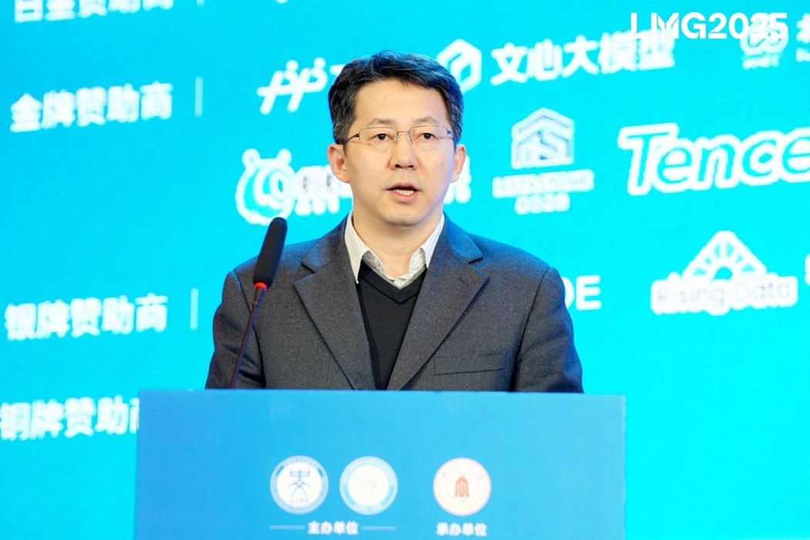
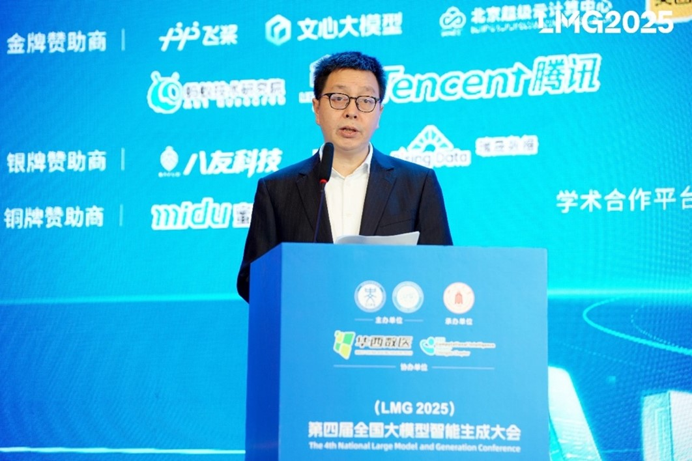
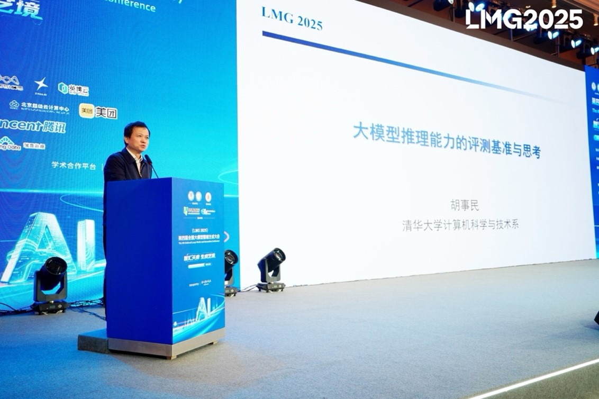
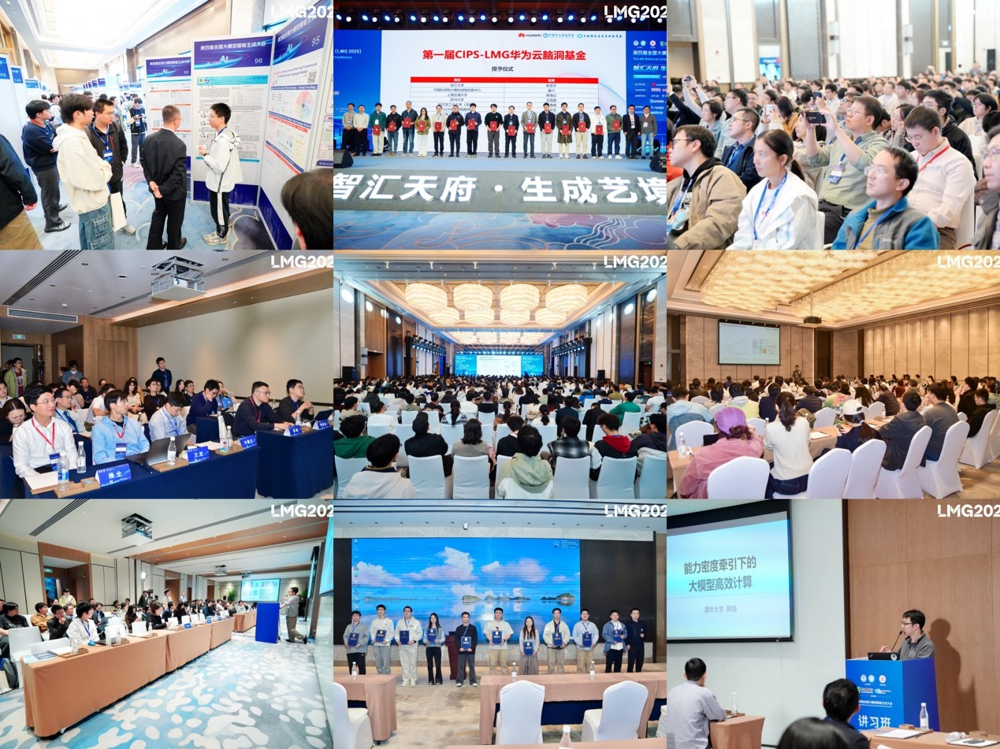
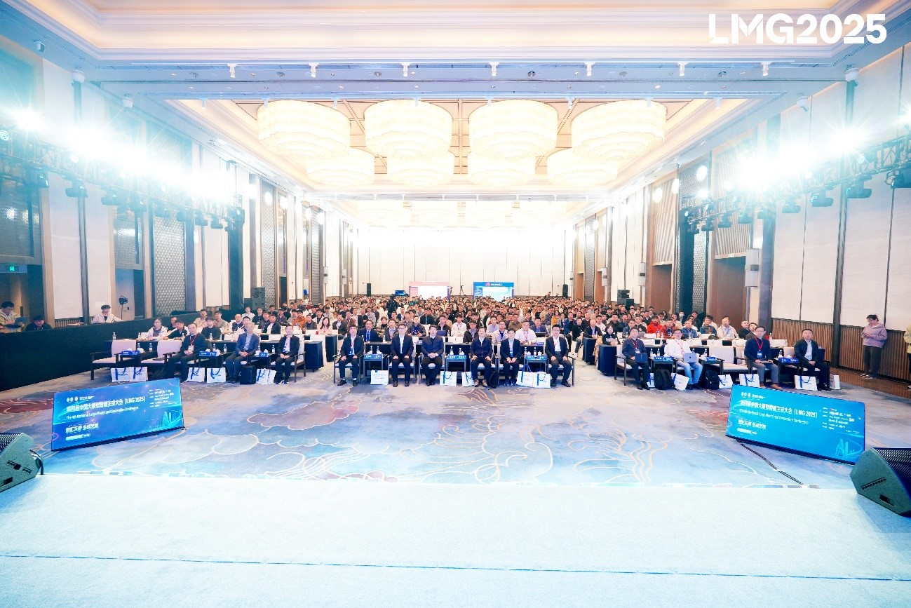
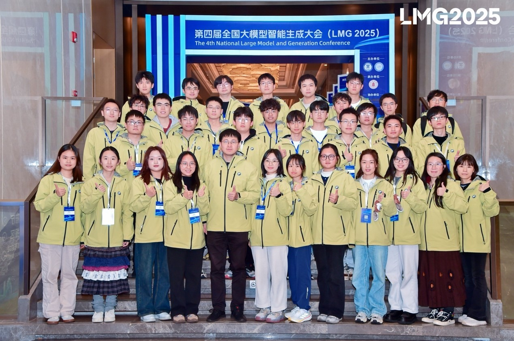

From November 1 to 3, 2025, the 4th National Conference on Large Model Generative Intelligence (LMG 2025) was grandly held in Chengdu, Sichuan Province. Hosted by the Special Committee on Large Models and Generation of the Chinese Information Processing Society of China (CIPS) and undertaken by Sichuan University, the conference was organized by the College of Computer Science (College of Software, College of Intelligent Science and Technology) of Sichuan University. With the theme "Intelligence Gathers in Tianfu, Forging a Generative Artistic Realm", it focused on cutting-edge explorations and key technological breakthroughs in the field of generative intelligence. During the conference, many academicians, renowned experts and scholars at home and abroad, as well as leading figures in the industry, delivered invited reports at the main forum, systematically sharing the latest research achievements and practical experience. Meanwhile, 16 thematic sub-forums on large models and 4 cutting-edge technology workshops were held, inviting more than 100 experts and young scholars to conduct in-depth exchanges. The conference attracted nearly 1,000 experts and scholars from across the country, facilitating full collision of ideas and extensive exchange of achievements, and building a high-level academic exchange platform for promoting the development and application innovation of generative intelligence technology.
 
On the morning of November 1, the conference officially opened. Mr. Lu Songming, Secretary of the Party Leadership Group and Director of the Sichuan Provincial Department of Science and Technology, attended the opening ceremony, extended warm congratulations on the convening of the conference and delivered a speech.

    
     
    Mr. Lu Songming, Secretary of the Party Leadership Group and Director of the Sichuan Provincial Department of Science and Technology, delivering a speech

 
Professor Liu Chao, Chairman of the Conference, Member of the Standing Committee of the Party Committee and Vice President of Sichuan University, attended the opening ceremony and delivered a speech, extending warm congratulations on the successful convening of the conference and wishing the conference a complete success.

    
     
    Professor Liu Chao, Chairman of the Conference, Member of the Standing Committee of the Party Committee and Vice President of Sichuan University, delivering a speech

 
Professor Sun Le, Researcher of the Institute of Software, Chinese Academy of Sciences and Secretary-General of the Chinese Information Processing Society of China (CIPS), Professor Zhang Min, Director of the Special Committee on Large Models and Generation and Distinguished Assistant to the President of Harbin Institute of Technology (Shenzhen), and Professor Zhang Yue, Chairman of the Program Committee of the Conference and Professor of Westlake University, attended the opening ceremony and delivered speeches. They introduced and exchanged views on the development of the society, the preparation and organization of the conference, and fully affirmed the work done by Sichuan University for the smooth convening of the conference.
Professor Lü Jiancheng, Chairman of the Program Committee of the Conference and Dean of the College of Computer Science of Sichuan University, as well as many academicians, experts and scholars, attended the opening ceremony. The entire opening ceremony was hosted by Professor Lei Wenqiang, Chairman of the Organization Committee of the Conference and Professor of the College of Computer Science of Sichuan University.
After the opening ceremony, Academician Hu Shimin of the Chinese Academy of Sciences and Professor of Tsinghua University delivered an invited report titled "Evaluation Benchmarks and Reflections on the Reasoning Ability of Large Models". The report not only systematically presented cutting-edge scientific research achievements, but also reflected profound insights into the wave of artificial intelligence development. Academician Hu's sharing provided important theoretical guidance and practical reference for promoting the prosperity of the domestic large model ecosystem and building the computing power foundation for the new industrial revolution.

    
     
    Academician Hu Shimin delivering an invited report

 
In the invited report session, Professor Wen Jirong, Executive Dean of the Gaoling School of Artificial Intelligence of Renmin University of China, Professor Zhou Haihong of the Central Conservatory of Music, Yang Zhenhua, Director of the Technology Innovation Department of Huawei Cloud, Professor Wang Liwei of the School of Intelligence of Peking University, Professor Iryna Gurevych, Former President of the Association for Computational Linguistics (ACL), and Professor Yulan He of King's College London, together with other scholars and industry representatives, delivered invited reports respectively. Centering on multiple perspectives such as the capability boundaries of large models, differences in human cognition, engineering implementation, changes in machine learning theories, human-machine collaboration, and trustworthy reasoning of models, they systematically discussed the key issues and development directions faced by large models in moving towards general artificial intelligence and scientific research applications.

    
     
    "AI for Arts" Achievement Exhibition and Performance

 
After the main forum, the conference specially organized an "AI for Arts" Achievement Exhibition and Performance, which was a immersive stage practice integrating technology and music, co-presented by Professor Lei Wenqiang's team from the College of Computer Science of Sichuan University and the Sichuan Symphony Orchestra. The concert was co-planned by Professor Lei Wenqiang and international conductor Darrell Ang, with the participation of many artists including lyric coloratura soprano Wu Bixia and erhu performer Zhu Lin. Among them, the AI visual creation was completed by undergraduates led by Professor Lei Wenqiang within one month. The exhibition demonstrated the in-depth participation of artificial intelligence in emotional construction, stage language shaping and artistic form innovation. Large model technology has evolved from an "auxiliary tool" to a "co-creation partner", highlighting the great potential of AI in the field of future artistic creation and generation, and marking that artistic creation has entered a new stage of "inspiration symbiosis".

    
     
    Scene of LMG 2025 Conference

 
In addition to the main forum, the conference also set up 16 thematic sub-forums on large models and 4 cutting-edge technology workshops, inviting more than 100 experts and scholars to give academic reports. The topics covered cutting-edge directions such as basic theories of large models, embodied intelligence, and humanistic and artistic intelligence. Meanwhile, the conference received nearly 160 poster submissions and attracted nearly 1,000 representatives from academia and industry across the country to conduct in-depth exchanges on the latest progress and key technologies in the field of large model generative intelligence.

    
     
    Group photo of LMG 2025 Conference

 
Focusing on cutting-edge explorations and key technological breakthroughs in the field of large models and generative intelligence, the conference brought together high-level forces from academia and industry, systematically demonstrating the latest research progress and application achievements of China in the field of generative artificial intelligence. It has exerted a positive impact on promoting relevant theoretical innovation, technological landing and cross-border integration. The conference not only built a high-quality academic exchange platform for experts and scholars, but also provided important ideological inspiration and practical demonstration for generative intelligence technology to serve the development of new quality productive forces and empower the upgrading of culture, art and industry.
Through organizing this conference, the laboratory has further deepened academic exchanges with major universities in the field of artificial intelligence. Facing the global changes triggered by large models and generative artificial intelligence, the laboratory will strengthen basic theoretical research, break through key core technologies, strive to cultivate top innovative talents adapting to the needs of the intelligent era, and contribute to the high-quality development of artificial intelligence in China.

    
     
    Group photo of volunteers from our laboratory participating in the organization

<!--more-->