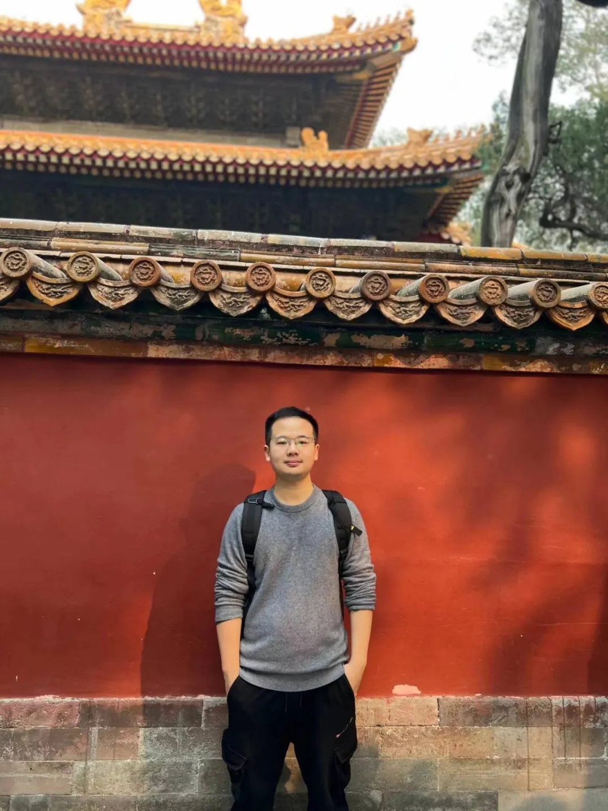
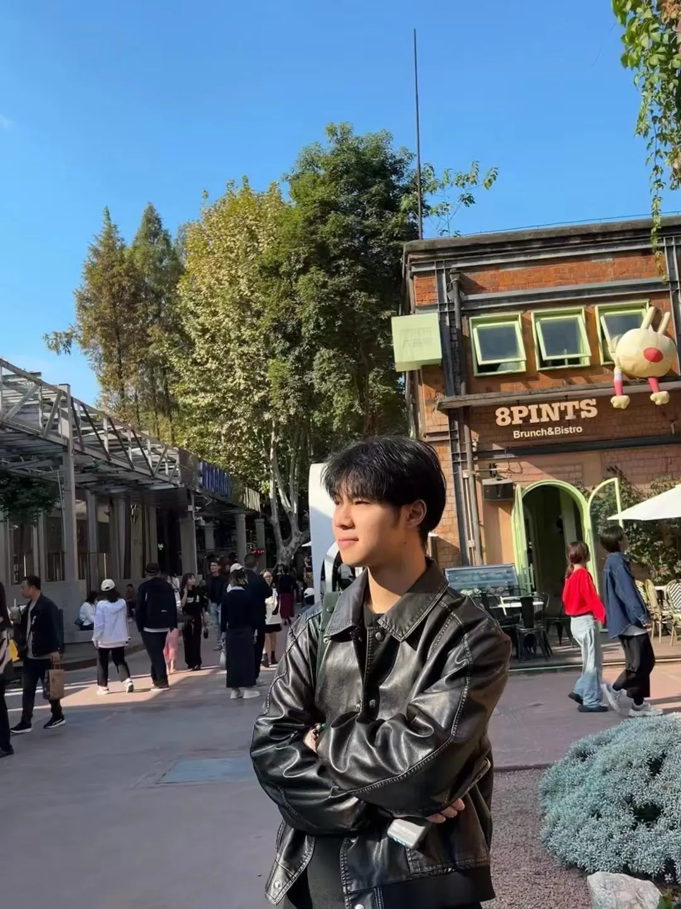

We warmly congratulate the two 2022-grade master students of Professor Lei Wenqiang's research group on their outstanding achievements. During the autumn recruitment, both Zhang Tong and Chen Yue have successfully secured over 10 SSP+ offers and talent program offers from major tech companies including Tencent, ByteDance, Alibaba, Ant Group, and Xiaohongshu.

In the autumn recruitment, major company offer tiers generally range from senior positions to high, SSP tier, SSP+ tier, and talent program. Among them, SSP+ tier and talent program offers are particularly rare and represent the highest level of recruitment that companies can offer, regardless of whether it's considering salary expectations or assessing recruitment difficulty.

## Zhang Tong Enters Tencent "Qingyun" and Ant "Star" Talent Program

Zhang Tong has been selected for Tencent's "Qingyun" and Ant Group's "Star" talent programs, and is joining the Tencent Computer Vision Research Division to conduct research on large model combination search technology.

    

## Chen Yue Achieves Master-Level Top Tier Recognition

Chen Yue has received over 10 SSP+ offers and achieved recognition at the highest master's level.

    

## About Professor Lei Wenqiang

Professor Lei Wenqiang leads the NLP Laboratory at Sichuan University. His research interests include natural language processing, large language models, and information extraction. Under his guidance, students consistently achieve excellent results in both academic research and industry recruitment, demonstrating the laboratory's strength in cultivating top talent.

    

---

We extend our sincere congratulations to Zhang Tong and Chen Yue on their achievements and wish them continued success in their careers!