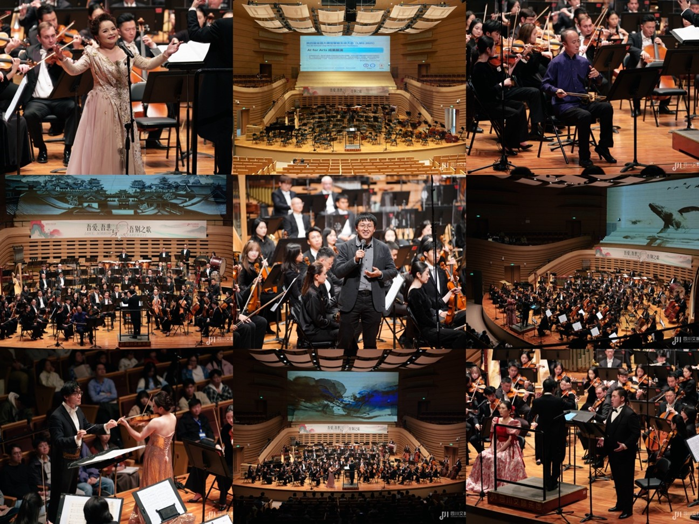

2025年11月1日至3日，第四届全国大模型智能生成大会（LMG 2025）在四川成都隆重举行。本次大会由中国中文信息学会大模型与生成专委会主办、四川大学承办，四川大学计算机学院（软件学院、智能科学与技术学院）组织，以“智汇天府，生成艺境”为主题，聚焦智能生成领域的前沿探索与关键技术突破。大会期间，国内外多位院士、知名专家学者及产业界领军人物在主论坛作特邀报告，系统分享最新研究成果与实践经验；同时举办了16场大模型主题分论坛和4场前沿技术讲习班，邀请百余位专家和青年学者开展深入交流。大会共吸引全国近千名专家学者参会，思想充分碰撞，成果广泛交流，为推动智能生成技术发展与应用创新搭建了高水平学术交流平台。
 
11月1日上午，大会正式开幕。四川省科技厅党组书记、厅长路松明先生出席大会开幕式，对大会召开表示热烈祝贺并致辞。

    
     
    四川省科学技术厅党组书记、厅长路松明先生致辞

 
大会主席、四川大学党委常委、副校长刘超教授出席开幕式并发表致辞，对大会的顺利召开表示热烈祝贺，并祝会议取得圆满成功。

    
     
    大会主席、四川大学党委常委、副校长刘超教授致辞

 
中国科学院软件研究所研究员、中国中文信息学会秘书长孙乐教授，大模型与生成专委会主任、哈尔滨工业大学（深圳）特聘校长助理张民教授，大会程序委员会主席、西湖大学张岳教授出席大会开幕式并致辞，围绕学会建设情况、大会筹备与组织安排等内容作了介绍和交流，对四川大学为大会顺利召开所作的工作给予充分肯定。
大会程序委员会主席、四川大学计算机学院院长吕建成教授等多名院士、专家学者出席大会开幕式。开幕式全程由大会组织主席、四川大学计算机学院雷文强教授主持。
开幕式后，中国科学院院士、清华大学胡事民教授以《大模型推理能力的评测基准与思考》为题作特邀报告，整场报告不仅系统呈现了前沿科研成果，更体现了对人工智能发展浪潮的深刻洞察。胡院士的分享，为推动国产大模型生态繁荣与构筑新一代工业革命的算力基础，提供了重要的理论指引与实践参考。

    
     
    胡事民院士作特邀报告

 
特邀报告环节，中国人民大学高瓴人工智能学院执行院长文继荣教授、中央音乐学院周海宏教授、华为云技术创新部部长杨振华、北京大学智能学院王立威教授、国际计算语言学学会(ACL)前主席Iryna Gurevych教授、英国伦敦国王学院Yulan He教授等学者与业界代表分别作特邀报告，围绕大模型能力边界、人类认知差异、工程化落地、机器学习理论变革、人机协作及模型可信推理等多个角度，系统探讨了大模型在迈向通用人工智能和科研应用过程中面临的关键问题与发展方向。

    
     
    “AI for Arts”成果展演

 
主论坛后，本届大会特别组织了“AI for Arts”成果展演，由四川大学计算机学院雷文强教授团队携手四川交响乐团共同呈现一场沉浸式科技与音乐交织的舞台实践。音乐会展演由雷文强教授与国际指挥家洪毅全（Darrell Ang）共同策划，抒情花腔女高音吴碧霞、二胡演奏家朱霖等多位艺术家参与演出，其中AI视觉创作由雷文强教授带领本科生在一个月内完成。展演展示了人工智能在情感构建、舞台语言塑造与艺术形式创新中的深度参与。大模型技术从“辅助工具”迈向“共创伙伴”，彰显了 AI 在未来艺术创作生成领域的巨大潜能，标志着艺术创作正步入“灵感共生”的新阶段。

    
     
    LMG2025大会现场

 
除大会主论坛外，本届大会还设立了16场大模型主题分论坛和4场前沿技术讲习班，邀请百余位专家学者作学术报告，议题涵盖大模型基础理论、具身智能、人文艺术智能等前沿方向。同时，大会共收到近160份海报投稿，吸引全国近千名学界与产业界代表参会，围绕大模型智能生成领域的最新进展与关键技术展开深入交流。

    
     
    LMG2025大会合影

 
本届大会聚焦大模型与智能生成领域的前沿探索与关键技术突破，汇聚学界与产业界高水平力量，系统展示了我国在生成式人工智能领域的最新研究进展与应用成果，对推动相关理论创新、技术落地及跨界融合产生了积极影响。大会不仅为专家学者搭建了高质量的学术交流平台，也为智能生成技术服务新质生产力发展、赋能文化艺术与产业升级提供了重要思想启迪与实践示范。
通过组织本次会议，实验室进一步深化了与各大高校在人工智能领域的学术交流。面向大模型与生成式人工智能引发的全球性变革，实验室将加强基础理论研究，突破关键核心技术，着力培养适应智能时代需求的拔尖创新人才，为我国人工智能高质量发展贡献力量。

    
     
    参与组织的我实验室志愿者合影

<!--more-->