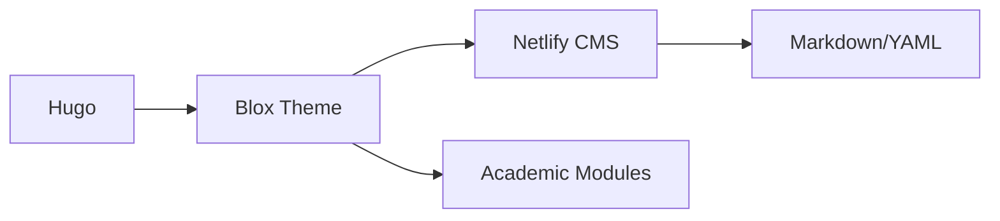

## 🌟 项目亮点

Hugo Blox 是面向非技术用户的 Hugo 主题生态系统，提供：

- **模块化构建**：200+ 可组合的内容块（简历、出版物、项目展示等）
- **实时编辑器**：基于 Netlify CMS 的可视化配置界面
- **学术友好**：自动处理 BibTeX 引用，支持 LaTeX 公式
- **性能优化**：默认 Lighthouse 评分 ≥95（SSG 优势）

## 🛠️ 技术栈



## 🚀 快速开始

```bash
# 使用模板创建
git clone https://github.com/hugo-blox/starter-kit my-site
cd my-site && hugo server
```

或通过我们的 [在线生成器](https://starter.hugo-blox.org) 初始化项目

## 用户案例

| 机构 | 类型 | 链接 |
|------|------|------|
| Stanford ML Group | 学术实验室 | [查看](https://ml.stanford.edu) |
| NeuroTechX | 社区网站 | [查看](https://neurotechx.com) |

> 📌 项目荣获 2023 年 Jamstack 最佳开源主题奖
```

实际使用时建议：
1. 将预览图 `hugo-blox-preview.png` 放入项目的 `assets/media/` 目录
2. 替换演示链接为真实的 Hugo Blox 演示站点
3. 在 GitHub 仓库添加 topics 如 "hugo-theme academic-website"

这个方案突出了项目的可视化特点和学术场景适用性，同时通过 Mermaid 图表和代码块增强技术说明的可读性。